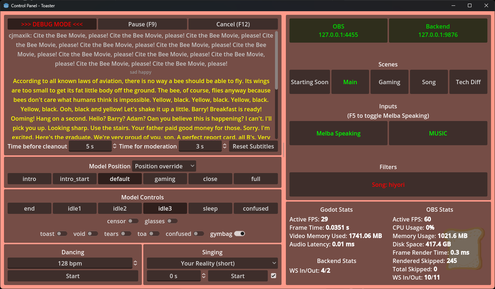

# Melba Toaster

This is the presentation part of NOM Network's VTuber **[Melba Toast](https://www.twitch.tv/melbathetoast/)**.

Written using [Godot](https://godotengine.org/) and GDScript, this program allows the Melba Toast model to speak, show animations, have expressions and such, driven by the backend. Includes the Control Panel.

Communication with the backend follows [this API schema](API_SCHEMA.md).

**Control panel interface**


## How to use

1. Install the latest minor version of [Godot 4.2](https://godotengine.org/download/windows/) (we are currently using [4.2 RC 2](https://godotengine.org/article/release-candidate-godot-4-2-rc-2/#downloads)).

2. Clone this repo via Git:

    ```bash
    git clone https://github.com/NOM-Network/Melba-Toaster.git
    ```

    Alternatively, you can Download ZIP package using the green "Code" button and unzip it.

3. In the `config` folder, duplicate `prod.cfg.example` file, rename it to `prod.cfg` and fill it out with the connection details for both OBS and backend websockets (make sure they are available).

4. Open the project in Godot.

5. Hit F5 in Godot editor. Live2D and Control Panel scenes should start automatically.

> The project can run without OBS and/or the backend, but nothing will actually happen. You can find a [mock backend server](backend/README.md) in the `backend` folder.

### Song support

Melba can sing! Song support is outlined in a [separate document](assets/songs/README.md).

### Note for Mac/Linux users

This project uses Windows libraries for Cubism extension. If you need to use Toaster on Mac or Linux, you have to [build them first](https://github.com/MizunagiKB/gd_cubism/blob/main/doc/BUILD.en.adoc#build-for-macos), then put them in `addons/gd_cubism/bin` folder.

## License

Melba Toast © 2023 NOM Network and contributors.

Code is licensed under a [AGPL 3.0 (and later) license](LICENSE.md).

Art assets are licensed under a [CC BY-SA 4.0 license](LICENSE-ASSETS.md).

This project uses [New Bread font](https://www.dafont.com/new-bread.font) by Syafrizal a.k.a. Khurasan.

This project uses [Cubism for GDScript](https://github.com/MizunagiKB/gd_cubism) by MizunagiKB.
